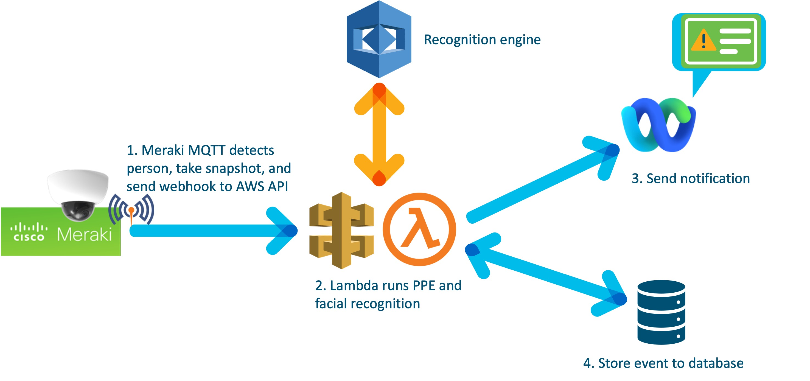
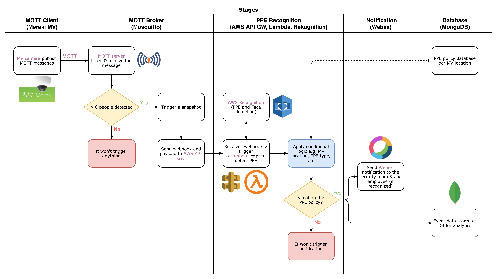
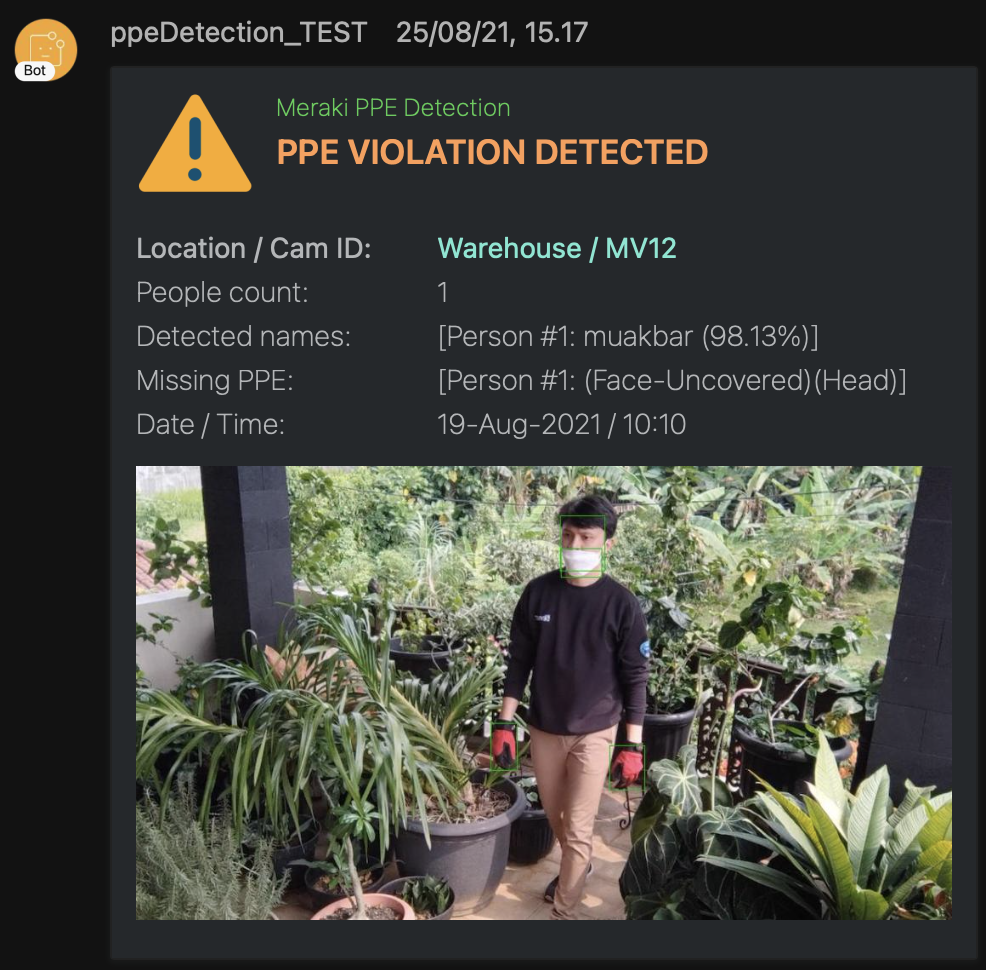

[](https://developer.cisco.com/codeexchange/github/repo/mfakbar/meraki-ppe-detection)

# Meraki PPE and Face Detection for Workplace Safety

A proof of concept that turns a Meraki MV person-detection event into a PPE check, an optional face match, a Webex alert, and a searchable safety record.

> This is legacy demonstration code, not a production safety system. It uses 2021-era dependencies and handles images and biometric data. Review the [limitations and privacy guidance](#prototype-limitations-and-production-guidance) before running it.

## What this repository does

The project connects five stages:

1. A Meraki MV camera publishes person-count events through MV Sense and MQTT.
2. `snapshot_and_trigger.py` requests a camera snapshot and sends its URL to AWS API Gateway.
3. AWS Lambda uses Rekognition to check for face, hand, and head covers and to search a face collection.
4. The Lambda function annotates the image and sends a Webex card to a safety space. If a face is matched, it also sends a direct reminder to that person.
5. The event is stored in MongoDB for later review and reporting.



## Why it exists

Safety teams cannot watch every camera continuously. This project demonstrates how an existing camera can become an event-driven safety sensor: detect a person, inspect one image, alert the right people, and retain structured evidence for follow-up.

The intended benefits are:

- faster awareness of possible PPE violations;
- direct, contextual notifications with an annotated image;
- a history of events by camera, location, time, person, and missing PPE;
- a reusable integration pattern for Meraki MV, cloud vision, messaging, and analytics.

## Concept and data flow

```text
Meraki MV -> MQTT -> local subscriber -> Meraki snapshot API
          -> API Gateway -> Lambda -> S3 + Rekognition
          -> Webex notifications + MongoDB event record
```

The camera performs the lightweight trigger at the edge. The local subscriber requests a snapshot only when the MQTT person count is greater than zero. Cloud services perform image analysis and the notification/database systems turn that result into an operational workflow.



## Components

| Component | Role |
| --- | --- |
| Meraki MV + MV Sense | Publishes person-count events and provides snapshots |
| MQTT broker | Carries MV Sense events to the local subscriber |
| `snapshot_and_trigger.py` | Listens for events, requests snapshots, and invokes the cloud workflow |
| API Gateway + AWS Lambda | Receives each event and orchestrates the analysis |
| Amazon S3 | Temporarily stores the source and annotated snapshots |
| Amazon Rekognition | Detects PPE and searches the enrolled face collection |
| Webex | Sends team alerts and optional direct messages |
| MongoDB Atlas | Stores event details for review and analytics |

## Reproduce the proof of concept

### 1. Prerequisites

You need:

- a Meraki MV camera, MV Sense license, Dashboard API key, and camera serial number;
- an MQTT broker reachable from both the camera and the machine running the subscriber;
- an AWS account with S3, Rekognition, Lambda, and API Gateway access;
- a MongoDB Atlas database;
- a Webex bot and a Webex space;
- a Python environment compatible with the pinned 2021 dependencies. Python 3.8 most closely matches the original Lambda setup.

Use a test camera, test identities, and non-production cloud accounts for the first run.

### 2. Clone and install

```bash
git clone https://github.com/mfakbar/meraki-ppe-detection.git
cd meraki-ppe-detection
python3.8 -m venv .venv
source .venv/bin/activate
python -m pip install --upgrade pip
python -m pip install -r requirements.txt
```

If the pinned packages do not install on your operating system, reproduce the project in a Python 3.8 container or update and retest the dependency set before continuing.

### 3. Configure AWS and the face collection

1. Create an S3 bucket for the demonstration.
2. Add reference JPG images. Each filename becomes the external identity used by the sample, for example `employee-alias.jpg`.
3. Set the bucket and collection names in:
   - `face_collection/create_collection.py`
   - `face_collection/add_face_to_collection.py`
   - `lambda/ppe_detection_lambda.py`
4. Configure AWS credentials locally, then create and populate the collection:

```bash
aws configure
python face_collection/create_collection.py
python face_collection/add_face_to_collection.py
```

The sample later derives a Webex email address from the image filename. Update `email_domain` in `lambda/ppe_detection_lambda.py` to match your test users.

### 4. Configure MongoDB and Webex

Create a MongoDB database and collection for events, then set these values in `lambda/ppe_detection_lambda.py`:

- `Database`: MongoDB connection string;
- `Cluster`: database name;
- `Events_collection_name`: event collection name;
- `ppe_requirement`: required PPE types.

Create a Webex bot, add it to the destination space, and set `WEBEX_TOKEN` and `WEBEX_ROOM_ID` in `lambda/webex_lambda.py`.

Do not commit real API keys, tokens, or database credentials. For anything beyond a short-lived lab, replace the hard-coded values with Lambda environment variables or a secrets manager and use an IAM execution role instead of AWS access keys in source.

### 5. Deploy the Lambda function

1. Build a Lambda deployment package containing `ppe_detection_lambda.py`, `webex_lambda.py`, and the required third-party libraries.
2. Create a Lambda function with handler `ppe_detection_lambda.lambda_handler`.
3. Grant the function the minimum S3 and Rekognition permissions it needs.
4. Add API Gateway as an HTTP trigger.
5. Put the resulting invoke URL in `AWS_API_URL` inside `snapshot_and_trigger.py`.

The included `lambda/deployment-package.zip` is a historical artifact. Rebuild the package for your selected Lambda runtime instead of assuming that archive is current.

### 6. Configure Meraki MV and MQTT

1. Enable MV Sense on the camera.
2. Configure the camera to publish to your MQTT broker.
3. In `snapshot_and_trigger.py`, set:
   - `MV_API_KEY`;
   - `MV_CAMERA_SN`;
   - `MQTT_SERVER` and an integer `MQTT_PORT`;
   - `AWS_API_URL`.
4. Use a private, authenticated, TLS-enabled MQTT broker for any environment beyond a disposable lab.

### 7. Run and verify

```bash
python snapshot_and_trigger.py
```

Walk into the camera's field of view and verify the pipeline stage by stage:

1. the subscriber receives `/merakimv/<serial>/0` with a person count above zero;
2. the Meraki Snapshot API returns an accessible image URL;
3. API Gateway invokes the Lambda function;
4. Rekognition returns PPE and face-search results;
5. Webex receives an alert with the annotated snapshot;
6. MongoDB contains a new event document.

## Expected outcome

The safety space receives a card containing the camera location, people count, detected identity when available, missing PPE, timestamp, and annotated image. A matched employee receives a direct reminder, and MongoDB retains the event for analysis.



## Prototype limitations and production guidance

- The current Lambda path continues to notify and store an event even when no PPE violation is reported. Add and test an explicit violation gate before operational use.
- `SearchFacesByImage` searches using the largest face in the image; this sample should not be treated as reliable multi-person identification.
- The current snapshot helper needs correction before an end-to-end run: it does not format the camera serial into the snapshot endpoint correctly and later treats the returned URL string as a response object.
- The sample reuses fixed S3 object names, which can overwrite concurrent events.
- The original design makes an annotated image publicly readable for Webex rendering. Use controlled delivery, short retention, encryption, and least-privilege access instead.
- PPE and face results are probabilistic. Require human review before taking action that affects a person.
- Obtain the required consent and complete privacy, biometric-data, retention, and workplace-policy reviews for your jurisdiction.

## References

- [Cisco Meraki MV Sense and MQTT](https://developer.cisco.com/meraki/build/mv-sense-documentation/)
- [Cisco Meraki Snapshot API](https://developer.cisco.com/meraki/mv-sense/rest-api/)
- [Amazon Rekognition PPE detection](https://docs.aws.amazon.com/rekognition/latest/dg/ppe-detection.html)
- [Amazon Rekognition face collections](https://docs.aws.amazon.com/rekognition/latest/dg/collections.html)
- [Webex bots](https://developer.webex.com/create/docs/bots)

## Contacts

- Hung Le — hungl2@cisco.com
- Muhammad Akbar — muakbar@cisco.com
- Swati Singh — swsingh3@cisco.com

## License

This project is available under the [MIT License](./LICENSE).
